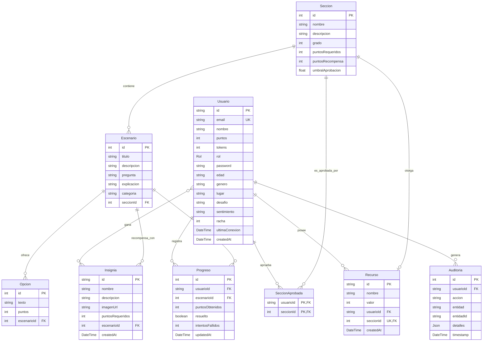
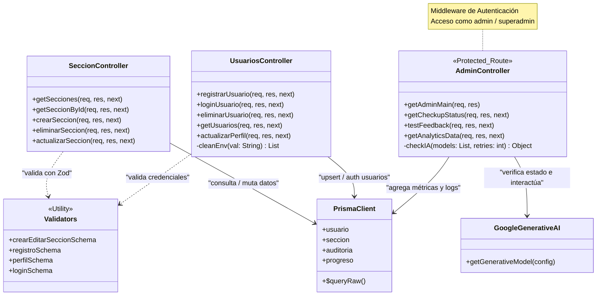

# Mate+


## Backend Core

Pre-Beta 1.0 para el Back End del proyecto "Aplicación de aprendizaje de Matemática" en **InnovaLab**. La arquitectura está diseñada para ser escalable, profesional y compatible con entornos de despliegue serverless en **Vercel** y **PostgreSQL** en **Supabase**.

### Arquitectura

El proyecto se gestiona bajo una estructura de **Monorepo** utilizando `pnpm workspaces`. Esta configuración permite mantener el código del Back-End y del Front-End en un único repositorio, facilitando la gestión de dependencias compartidas y scripts de automatización desde la raíz del proyecto.

#### Stack Tecnológico

- **Runtime:** **Node.js** v24+
- **Framework:** **Express.js** v5 (Beta/LTS compatible)
- **ORM:** **Prisma** v6.4.1 (Stable - Native Engines)
- **Gestor de Paquetes:** `pnpm`
- **Base de Datos:** **PostgreSQL** (vía **Supabase**)
- **Gestor de Registro e Inicio de Sesión:** **Supabase Auth**
- **Despliegue:** **Vercel**
- **Integración LLM-CLI:** **Gemini Flash 2.5**
- **UX/UI:** Plantilla **FIGMA**

#### Roles y Permisos
- **usuario:** Perfil estándar para participantes. Acceso a escenarios interactivos y seguimiento de progreso.
- **admin:** Perfil con permisos de edición sobre contenidos (Secciones y Escenarios), edición de "prompt" de modelado del CLI pedagógico y acceso a Cuadros Estadísticos.
- **superadmin:** Perfil de gestión total, incluyendo edición de contenidos y manejo de credenciales/permisos.

#### Resiliencia en respuesta LLM-CLI (Fallback):
En caso de que no haya una Key configurada o se excedan los límites de cuota, el sistema activará automáticamente un modo de respaldo. En lugar de fallar, el servidor responderá utilizando la explicación técnica predefinida en el campo `explicacion` de la tabla **Escenarios**.

#### Auditoría
Se mantiene un seguimiento de las actividades de modificación en la tabla Auditoría.

### Nodo Administrativo

Consola de relevamiento y actividades administrativas, con acceso desde dirección web [/admin-be](https://deploy-mate-mas-front-end.vercel.app/admin-be) y requerimientos de inicio de sesión para su uso, brinda información relativa al estado y funcionamiento del Back-End, el LLM-CLI y la conexión de datos y también es el punto de acceso para los administradores desde el que pueden manejar condiciones y probar resultados del LLM-CLI, crear, editar buscar o eliminar en las tablas de Secciones y Escenarios y acceder a los gráficos en tiempo real

### Estructura del Proyecto

```bash
proyecto-matematicas-grupo8/
├── Back-End/
│   ├── api/
│   │   └── index.js
│   ├── prisma/
│   │   ├── schema.prisma
│   │   └── seed.js
│   ├── src/
│   │   ├── assets
│   │   │   ├── logonodo.png
│   │   │   ├── mascota_32.webp
│   │   │   └── mascota_510.webp
│   │   ├── config/
│   │   │   ├── prisma.js
│   │   │   └── supabase.js
│   │   ├── controllers/
│   │   │   ├── admin.controller.js
│   │   │   ├── auditoria.controller.js
│   │   │   ├── debug.controller.js
│   │   │   ├── escenario.controller.js
│   │   │   ├── progreso.controller.js
│   │   │   ├── seccion.controller.js
│   │   │   └── usuarios.controller.js
│   │   ├── exceptions/
│   │   │   └── api.exception.js
│   │   ├── middlewares/
│   │   │   ├── auth.middleware.js
│   │   │   ├── audit.middleware.js
│   │   │   └── error.middleware.js
│   │   ├── routes/
│   │   │   ├── api.routes.js
│   │   │   ├── progreso.routes.js
│   │   │   ├── seccion.routes.js
│   │   │   └── usuarios.routes.js
│   │   ├── services/
│   │   │   └── gemini  .service.js
│   │   ├── validators/
│   │   │   ├── seccion.validator.js
│   │   │   └── usuarios.validator.js
│   │   └── app.js
│   ├── supabase/
│   │   ├── .gitignore
│   │   └── config.toml
│   ├── .gitignore
│   ├── nodemon.json
│   ├── package.json
│   ├── vercel.json
│   ├── Readme.md
│   └── test.sql
├── Front-End/
├── .gitignore
├── .npmrc
├── package.json
├── pnpm-lock.yaml
├── pnpm-workspace.yaml
└── Readme.md
```

### Diagrama de Entidad-Relación (ERD)



---


### Diagrama de Clases



---
### Historial

- Revisión de tecnologías y arquitectura propuesta.
- Planteo de Proyecto “Math-Path”.
- Planteo de uso de tecnologías ‘pnpm’ y Prisma.
- Planteo de despliegue Vercel “serverless”.
- Primer commit.
- Definición e implementación de Stack.
  · Configuración de modelo y entorno para la base de datos remota (Prisma).
- Esquema de entidades: Usuarios, Sección, Escenario.
  . Lógica en controladores de Secciones y Escenarios.
  · Lógica en controladores de Usuarios, Admin y Superadmin.
- Documentación en “Back-End Readme.md”.
- Actualización en repositorio
- Configuración de Bd de test en PostgreSQL.
  · Migración de esquema ‘Prisma’.
  · Sembrado de datos mock.
  · Configuración de ‘Auth’.
- Configuración e implementación de ‘servidor modular local’ funcional.
- Listado e implementación de endpoints base para testing y pruebas de impacto.
- Actualización de Documentación y repositorio.
- Implementación de Test de LogIn y Registro.
  · Test “local” de ruteo del CRUD de endpoints.
  · Branch de oficio, acceso para Q&A.
- Infraestructura para Prueba de Concepto.
  · Cuentas Google, Supabase y Vercel.
- Inicio de implementación de validaciones.
  · Implementación de biblioteca y esquemas de validación Zod.
Actualización de Back-End en "main"
- Implementación de doble origen de datos
 · con archivos locales y WebDb
- Mecanismo para respuestas de inicio de sesión,
 · registro de usuarios persistente en archivo local
- Nodo administrativo (beta)
 · Gestión de estado Back-End
 · Gestión de asistencia CLI-LLM (beta)
 · Gestión de CRUDs de contenidos (beta)
 · Gestión de grafos estadísticos
Reunión con integrantes de Front-End y Q&A
Actualización de rama “producción-test” eliminando las implementaciones de simulación para Registro, Inicio de sesión y Db, actualización de Documentación
Test de despliegue de Producción activa en Vercel con conexión a WebDb
Revisión y optimización de Back-End

---


*Propuesta desarrollada para el equipo de Back End - InnovaLab 2026*
